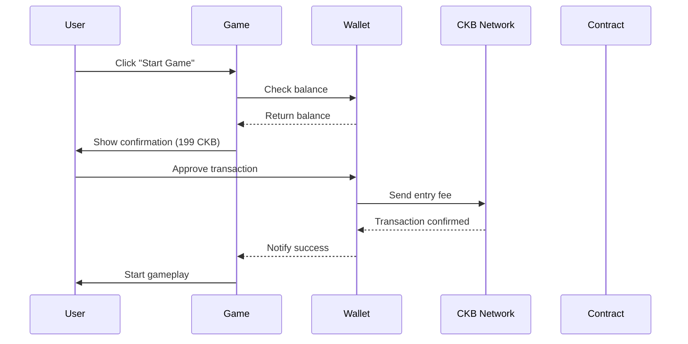

# CKB Integration - Endless Runner Game

This document provides a comprehensive guide for the real Nervos CKB blockchain integration in the Endless Runner game.

## Overview

The Endless Runner game now features complete real CKB blockchain integration, replacing the mock adapter with production-ready blockchain transactions. Players can:

- Pay entry fees (199 CKB) to play
- Earn rewards (400 CKB) for winning
- Collect CKB coins during gameplay (10 CKB each)
- View real-time transaction status
- Track game statistics on-chain

## Architecture

### Core Components

1. **CkbAdapter** - Real blockchain integration using CCC wallet connector
2. **GameEconomy** - Economic system manager with transaction orchestration
3. **TransactionStatus** - UI components for transaction monitoring
4. **CkbConfig** - Configuration management for all CKB-related settings

### Key Features

- ✅ Real CKB transactions via CCC wallet connector
- ✅ Balance checking and validation
- ✅ Entry fee payment processing
- ✅ Reward distribution system
- ✅ Transaction state monitoring
- ✅ Error handling and recovery
- ✅ Explorer integration
- ✅ Local storage persistence
- ✅ Anti-cheat validation
- ✅ Mobile-responsive UI

## Installation & Setup

### Dependencies

Ensure you have the following dependencies installed:

```bash
npm install @ckb-ccc/connector-react
# or
yarn add @ckb-ccc/connector-react
```

### Environment Configuration

Create environment variables:

```env
# Game contract addresses
VITE_GAME_CONTRACT_TESTNET=ckb1qyq...your-testnet-contract
VITE_GAME_CONTRACT_MAINNET=ckb1qyq...your-mainnet-contract

# Network configuration
VITE_CKB_NETWORK=testnet
VITE_CKB_RPC_URL=https://testnet.ckb.dev/rpc
VITE_CKB_INDEXER_URL=https://testnet.ckb.dev/indexer
```

### Wallet Provider Setup

Wrap your app with the CCC provider:

```tsx
import { ccc } from '@ckb-ccc/connector-react';

function App() {
  return (
    <ccc.Provider>
      <YourGameComponents />
    </ccc.Provider>
  );
}
```

## Usage

### Basic Game Integration

```tsx
import { EndlessRunner } from './components/games/EndlessRunner';

function GamePage() {
  const { signer } = ccc.useSigner();
  const { walletAddress } = ccc.useWallet();

  return (
    <EndlessRunner
      gameAddress="your-game-address"
      walletAddress={walletAddress}
      signer={signer}
      onConnect={() => console.log('Wallet connected')}
      onTx={(txHash) => console.log('Transaction:', txHash)}
      onWin={(winner) => console.log('Winner:', winner)}
    />
  );
}
```

### Transaction Monitoring

```tsx
import { TransactionStatus } from './components/TransactionStatus';

function TransactionHistory() {
  const [transactions, setTransactions] = useState([]);

  return (
    <TransactionStatus 
      transactions={transactions}
      network="testnet"
    />
  );
}
```

## Transaction Flow

### 1. Game Start Flow



### 2. Game Completion Flow

```mermaid
sequenceDiagram
    participant Game
    player Contract
    participant CKB Network
    participant Wallet

    Game->>Contract: Submit game result
    Contract->>Contract: Validate result
    Contract->>CKB Network: Send reward (400 CKB)
    CKB Network-->>Wallet: Reward confirmed
    Wallet-->>Game: Notify reward received
    Game->>User: Show results
```

## Configuration

### Game Economics

```typescript
const CKB_CONFIG = {
  ENTRY_FEE_CKB: 199,        // Entry fee
  REWARD_CKB: 400,           // Victory reward
  COIN_VALUE_CKB: 10,        // Value per coin
  TRANSACTION_FEE_RATE: 0.001, // 0.1% fee
};
```

### Network Settings

```typescript
const NETWORK_CONFIG = {
  TESTNET: {
    ckbRpcUrl: 'https://testnet.ckb.dev/rpc',
    explorerUrl: 'https://pudge.explorer.nervos.org',
  },
  MAINNET: {
    ckbRpcUrl: 'https://mainnet.ckb.dev/rpc',
    explorerUrl: 'https://explorer.nervos.org',
  },
};
```

## Error Handling

### Common Errors and Solutions

| Error | Cause | Solution |
|-------|-------|----------|
| Insufficient balance | Not enough CKB | Add funds to wallet |
| Wallet not connected | No wallet connection | Connect wallet first |
| Transaction failed | Network/rejection error | Retry transaction |
| Session expired | Game too long | Start new game |

### Error Recovery

```typescript
try {
  const result = await gameEconomy.startGame();
  if (!result.success) {
    // Show error message
    setError(result.error);
    // Offer retry option
    setShowRetry(true);
  }
} catch (error) {
  // Handle unexpected errors
  console.error('Game start failed:', error);
  setError('Unexpected error occurred');
}
```

## Security Considerations

### Transaction Security

1. **User Approval**: All transactions require explicit user approval
2. **Contract Validation**: Game contract validates all actions
3. **Fee Transparency**: Clear fee structure (0.1% of transaction)
4. **Anti-Cheat**: Session tracking prevents manipulation

### Best Practices

- Always validate transaction results on-chain
- Implement proper error boundaries
- Use secure wallet connections
- Monitor transaction status properly
- Handle network failures gracefully

## Testing

### Mock vs Real Integration

Switch between mock and real adapters:

```typescript
// For testing
import { MockCkbAdapter } from './systems/MockCkbAdapter';
const adapter = new MockCkbAdapter();

// For production
import { CkbAdapter } from './systems/CkbAdapter';
const adapter = new CkbAdapter();
```

### Test Scenarios

1. **Successful Game Flow**
   - Entry fee payment
   - Gameplay completion
   - Reward distribution

2. **Error Conditions**
   - Insufficient balance
   - Network failures
   - User rejection

3. **Edge Cases**
   - Session expiration
   - Transaction timeouts
   - Contract failures

## Performance Optimization

### Async Operations

- Non-blocking transaction monitoring
- Background balance updates
- Optimistic UI updates

### Caching Strategy

- Transaction status cached locally
- Balance updates debounced
- Statistics calculated efficiently

### UI Performance

- Minimal re-renders during gameplay
- Efficient state management
- Optimized transaction lists

## Monitoring & Analytics

### Transaction Tracking

```typescript
// Track transaction success rate
const stats = {
  totalTransactions: transactions.length,
  successfulTransactions: transactions.filter(tx => tx.status === 'confirmed').length,
  averageConfirmationTime: calculateAverageTime(transactions),
};
```

### Game Analytics

```typescript
// Track game economics
const analytics = {
  totalGamesPlayed: stats.totalGames,
  totalCkbSpent: stats.totalSpent,
  totalCkbEarned: stats.totalEarned,
  averageProfit: stats.averageProfit,
};
```

## Deployment

### Environment Configuration

```bash
# Production
VITE_CKB_NETWORK=mainnet
VITE_GAME_CONTRACT_MAINNET=ckb1qyq...production-contract

# Staging
VITE_CKB_NETWORK=testnet
VITE_GAME_CONTRACT_TESTNET=ckb1qyq...staging-contract
```

### Build Process

```bash
# Build for production
npm run build

# Deploy to your preferred hosting
npm run deploy
```

## Troubleshooting

### Common Issues

1. **Transaction Stuck**
   - Check network status
   - Verify wallet connection
   - Retry transaction

2. **Balance Not Updating**
   - Refresh wallet connection
   - Check network sync
   - Clear local cache

3. **Contract Not Responding**
   - Verify contract address
   - Check network configuration
   - Contact support

### Debug Tools

- Browser console logs
- Network tab in dev tools
- Transaction explorer
- Wallet connection status

## Future Enhancements

### Planned Features

1. **Batch Transactions**: Multiple games in single transaction
2. **Staking Rewards**: Lock CKB for bonus rewards
3. **Tournament Mode**: Competitive gameplay with prizes
4. **NFT Integration**: Unique game assets as NFTs
5. **Cross-Chain**: Support for other Nervos networks

### Scalability

- Layer 2 solutions for faster transactions
- State channels for instant gameplay
- Optimistic rollups for reduced fees

## Contributing

### Development Setup

```bash
# Clone repository
git clone <repository-url>

# Install dependencies
npm install

# Start development server
npm run dev
```

### Code Style

- Use TypeScript for type safety
- Follow React best practices
- Implement proper error handling
- Write comprehensive tests

## Support

### Documentation

- [CKB Documentation](https://docs.nervos.org/)
- [CCC Connector Guide](https://github.com/ckb-ccc/connector)
- [Transaction Flow Guide](./CKB_TRANSACTION_FLOW.md)

### Community

- [Nervos Discord](https://discord.gg/nervos)
- [GitHub Issues](https://github.com/your-repo/issues)
- [Developer Forum](https://talk.nervos.org/)

## License

This project is licensed under the MIT License - see the LICENSE file for details.

---

**Note**: This integration requires a deployed game contract on the Nervos CKB network. Replace the placeholder contract addresses with your actual deployed contracts before production use.
